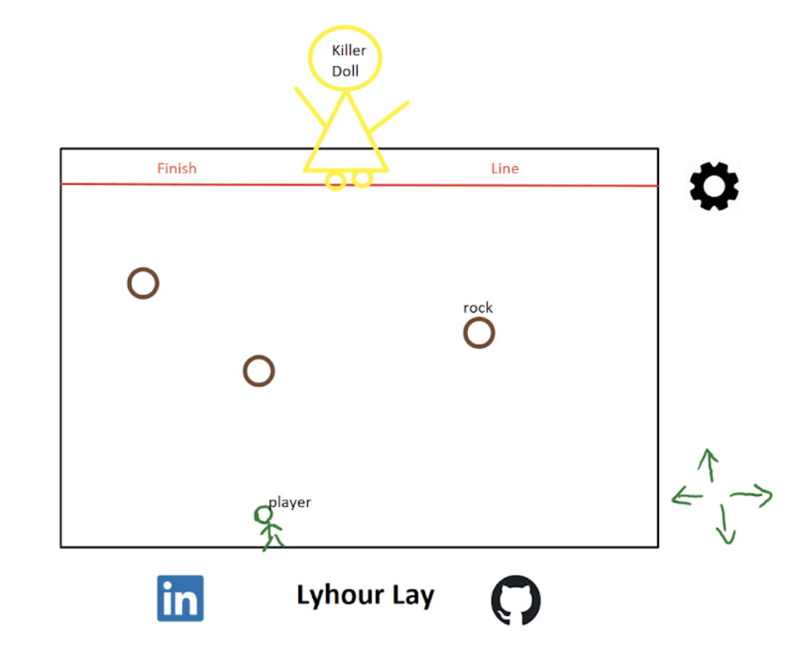

# Project Link:  https://lyhourlay1.github.io/Squid_Game_In_Your_Area/

# Squid Game(Red Light Green Light)

Background and overview: This game is inspired from the “Red Light Green Light” game from Squid Games. In this game, the player needs to walk across the field within the time limit. Otherwise, the player will lose the game. The player is allowed to walk only while music is playing. If the player makes any moves during the time music is not playing, the player will lose the game. The player can walk forward, backward, left , right using the direction array keys from the computer keyboard. (up arrow, down arrow, left arrow, right arrow). Additional features like walking diagonally and increasing the walking speed by press-hold the key would be added if there is extra time to implement. 

Functionality & minimum viable product: 
1. User can walk on the board with 4 directions(modifying the player position on the board by using an event listener in which the player presses specific keys) 
2. Within the given time interval if the user manages to cross the finish line on the board, the user will win
3. There is a timer with the music in the background. Users will lose if they walk after the timer sets off. 
4. A board is rendered with rocks are generated to block the player from just walking straight the whole game
5. There is a setting where you can adjust the volume of the music and pause the game. 

Addional functionality if there is extra time:
1. Users can walk diagonally if they left or right arrow key with up or down key at the same time(*). 
2. Users can speed up the walk by press-hold the key
3. Allow two players to play the game at the same time(one player uses awsd key and other uses arrow key)

This project will include:
1. A README production
2. About modal describes the background and rules of the game

Wireframes:

Technologies: 
1. Javascript: DOM and Single Page Website(AJAX) for the event listeners
2. Rails: game, player, board 
3. Html: use minimal html files to let the user choose the number of player and player#
4. CSS: Style the board and features like volume 
5. Canvas to help render the board 
6. Webpack to bundle and transpile the scripts
7. Npm to manage the project dependencies

Timeline: 
W9D4: Setup project(webpack, database, debugger)
W9D5: Make a Canvas display
W9D6: research on Canvas, front, and backend functionality 
W9D7: Render the Cavas as Board with player on there
W10D1: Finalize the backend functionality like controller, view, and models
W10D2: Add setting features like changin volument and add music to it,
W10D3: Finalize the design and try to play. Make it look pretty 

